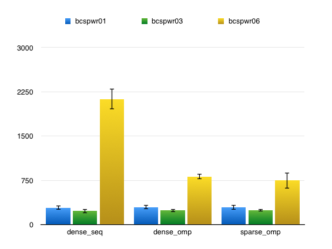
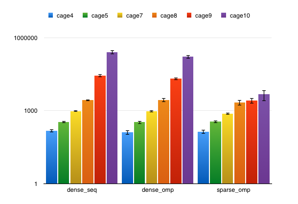
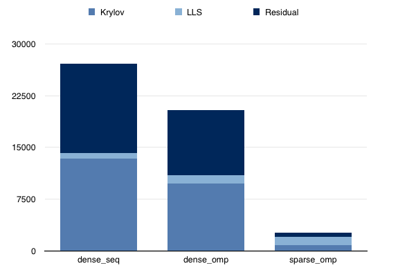

Project Report
======================

## Title

ParGMRES: A parallel linear solver

## Team member

- Yu-Lun Tsai (yulunt)
- Chih-Wei Chang (cchang3)

## Summary

We implemented the generalized minimal residual (GMRES) algorithm using both 
OpenMP and CUDA. We compared the performance of the OpenMP code between dense 
and compressed sparse row representation. Regarding the CUDA version, although 
we only have one version, we are trying to identify bottlenecks and compare 
the difference between GPU and CPU implementation.

## Challenges

One of the challenge here is implementation of linear algebra algorithm. We 
thought that the most complex part of the program is the part that compute 
the Krylov space. However, after we start implementing the algorithm, we 
realized that there is a linear least square part at the end of each iteration. 
We implemented three version to solve these problem: the power method for SVD, 
the Jacobian method for SVD, and QR householder reduction. We finally picked 
QR reduction to solve the LLS because it is not an iterative method and its 
complexity depends directly on the size of matrix. Besides, the Jacobian SVD 
consists of operations on small 2x2 matrices constructed by accessing 
different (i, j) locations. We considered it hard to being parallelized.   

The benefit of parallelize matrix operations becomes significant only when 
the matrix size is large enough. However, when the size increases, the memory 
footprints impact the overall performance as well. Most of our operations 
are memory bound. In order to improve the performance, we have to identify 
the part in code where we waste the bandwidth. 

<!-- ## Background -->

<!-- Describe the algorithm, application, or system you parallelized in computer -->
<!-- science terms. (Recall our discussion from the last day of class.) Figure(s) -->
<!-- would be really useful here. -->

<!-- ## Approach -->

<!-- Tell us how your implementation works. Your description should be sufficiently -->
<!-- detailed to provide the course staff a basic understanding of your approach. -->
<!-- Again, it might be very useful to include a figure here illustrating components -->
<!-- of the system and/or their mapping to parallel hardware. -->

## Result

We run our code on two sets of matrix: BCSPWR and Cage. The size of these matrix
varies cross a very large range, in which we can better test the scalability of
our algorithm. Also, the difference between the size scale can also show us the
effectiveness of parallization.

Matrix details for BCSPWR:
- BCSPWR01: 39-by-39, 85 non-zero entries.
- BCSPWR03: 118-by-118, 297 non-zero entries.
- BCSPWR06: 1454-by-1454, 3377 non-zero entries.

The results of BCSPWR is shown as following, the y-axis is linear-scale.
 

Matrix details for Cage:
- Cage4: 9-by-9, 49 non-zero entries.
- Cage5: 37-by-37, 233 non-zero entries.
- Cage7: 340-by-340, 3084 non-zero entries.
- Cage8: 1015-by-1015, 11,003 non-zero entries.
- Cage9: 3534-by-3534, 41,594 non-zero entries.
- Cage10: 11,397-by-11,397, 150,645 non-zero entries.

The results of Cage is shown as following, the y-axis is log-scale.
 

Besides, we also conduct the detail experiment on the following matrix:
- Cage 9: we examine the elapsed time for each part of our program, in which we
  can better understand the bottlenecks and the effectiveness or the overhead of
  parallelism.
 

First, we can see from the graph that LLS (linear least square) part does not
change too much among three different setting, and it does not consist of a
major part for the elapsed time. Therefore, we did not put our focus on the
optimization for the LLS.

On the other hand, the graph indicates that the major bottlenecks will be the
Krylov process and calculating the residual after each iteration. Therefore,
we can gain some improvement on the performance by working out the parallelism
in these two parts.

## References

Please provide a list of references used in the project.
