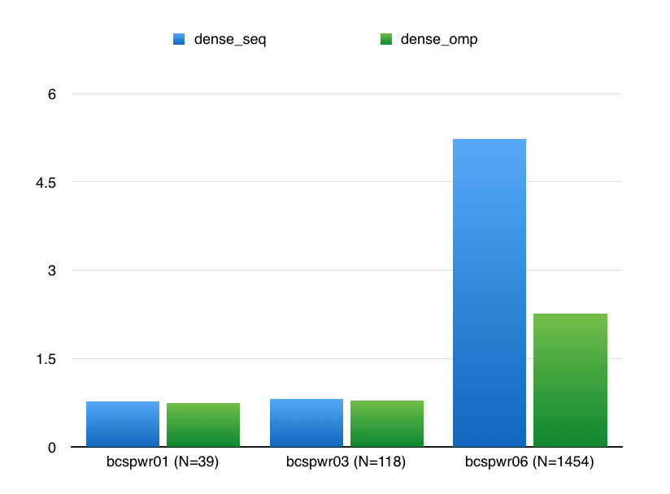
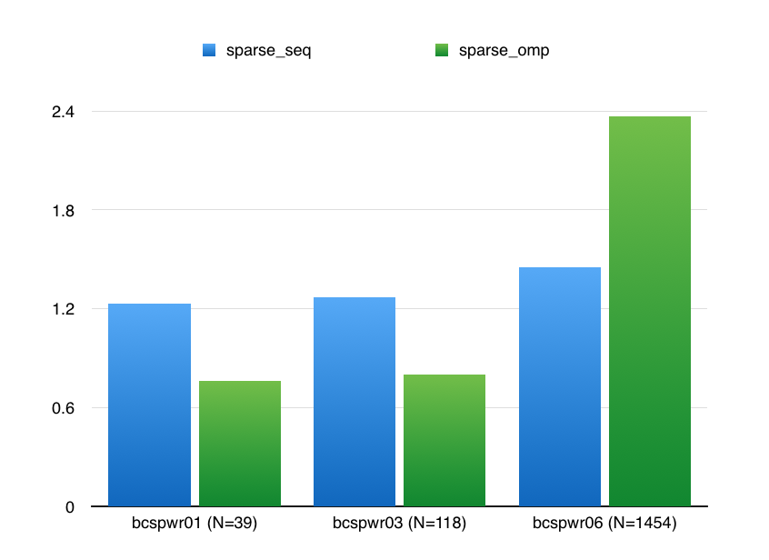
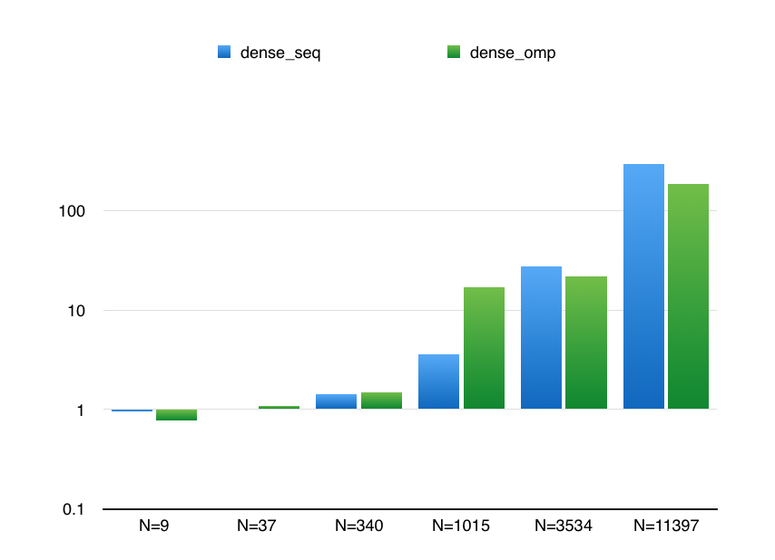
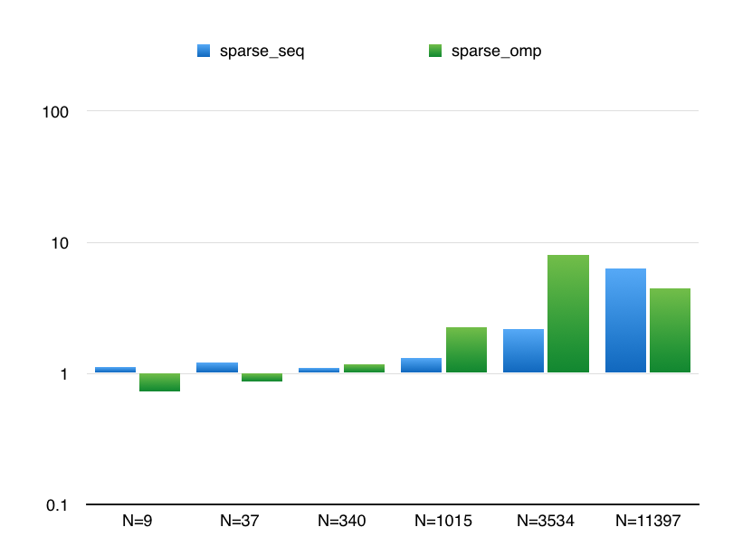
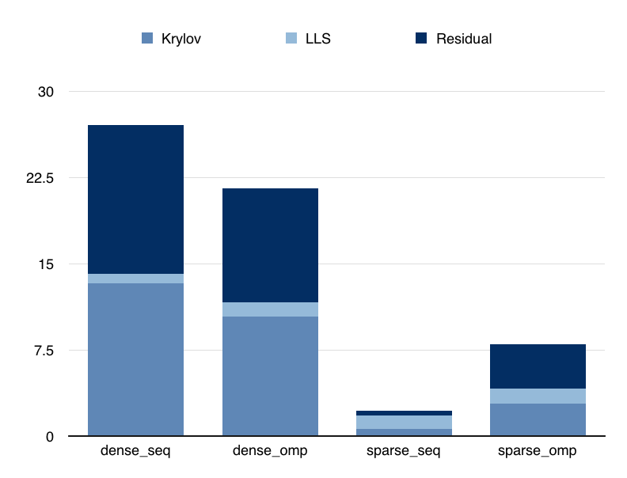
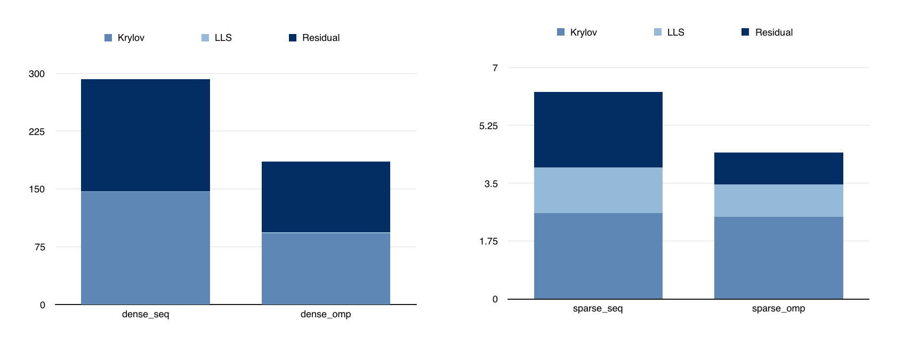

Project Report
======================

## Title

ParGMRES: A parallel linear solver

## Team member

- Yu-Lun Tsai (yulunt)
- Chih-Wei Chang (cchang3)

Equal work was performed by both project members.

## Summary

We implemented the generalized minimal residual (GMRES) algorithm using both 
OpenMP and CUDA. We compared the performance of the OpenMP code between dense 
and compressed sparse row representation. Regarding the CUDA version, although 
we only have one version, we are trying to identify bottlenecks and compare 
the difference between GPU and CPU implementation.

<!-- ## Challenges -->
<!-- One of the challenge here is implementation of linear algebra algorithm. We --> 
<!-- thought that the most complex part of the program is the part that compute  -->
<!-- the Krylov space. However, after we start implementing the algorithm, we    -->
<!-- realized that there is a linear least square part at the end of each iteration. --> 
<!-- We implemented three version to solve these problem: the power method for SVD,  -->
<!-- the Jacobian method for SVD, and QR householder reduction. We finally picked    -->
<!-- QR reduction to solve the LLS because it is not an iterative method and its     -->
<!-- complexity depends directly on the size of matrix. Besides, the Jacobian SVD    -->
<!-- consists of operations on small 2x2 matrices constructed by accessing           -->
<!-- different (i, j) locations. We considered it hard to being parallelized.        -->
<!-- The benefit of parallelize matrix operations becomes significant only when      -->
<!-- the matrix size is large enough. However, when the size increases, the memory   -->
<!-- footprints impact the overall performance as well. Most of our operations       -->
<!-- are memory bound. In order to improve the performance, we have to identify      -->
<!-- the part in code where we waste the bandwidth.                                  -->

## Background

Our project is to parallelize the generalized minimal residual method (GMRES). 
GMRES is by itself an iterative method, in which the main flow of the algorithm 
is inherently sequential. Therefore, we can only parallelize matrix operations 
but the entire algorithm. Its algorithm can be divided into three parts: constructing 
Krylov space, solving linear least square problem, and computing the residual 
between target vector. The first part consists of iterative matrix-vector 
multiplications. The second one consists of matrix multiplications and subtractions. 
The last one consists of matrix multiplication, subtraction and vector norm. 
These are operations that can be parallelized potentially. Our implementation 
focus on how to efficiently compute these operations. 

The performance of a program depends on how a data is stored as well. We tried 
two data structures in our project: dense representation and compressed sparse 
representation. The first one keep the original layout of a 2D matrix and the 
latter one only store non-zero indices and values. Matrix operations are memory 
bound so we anticipate that the dense representation does not perform as well as 
the compressed sparse format. If we categorize matrix operations into different 
asymptotic complexities, matrix operations are O(n^2) and most vector operations 
are O(n). It is important to identify the boundary that is able to benefit from 
parallelism and check whether an operation fulfills this condition. If it is not, 
a sequential version may be better compared to those overheads.

There are three challenges for this project. The first one is hard to find a baseline. 
Most implementation focus on constructing Krylov space and exchanging precondition 
matrix. They use external library to solve the LLS part, which we do not have access 
to the original code. The bottleneck is not just Krylov but it may be the LLS part 
so we decide to implement the entire GMRES algorithm by ourselves. The second 
challenge is that the test cases are hard to randomly generate. Whether an iterative 
method is capable to solve a large linear system depends on how you choose the 
precondition matrix. There are bunches of research to identify suitable precondition 
matrix. Therefore, we can only use a set of matrix collection that is published by 
other one such as matrix market. Also, the test cases from these source may not have 
an suitable range for experiments. The third challenge is that benefit of parallelism 
is not significant if the matrix size is small. However, our larger matrix test cases 
may not be allowed to run on the late days cluster. It consume too much memory and be 
killed by the system.

<!-- Describe the algorithm, application, or system you parallelized in computer -->
<!-- science terms. (Recall our discussion from the last day of class.) Figure(s) -->
<!-- would be really useful here. -->

## Approach

As we mentioned in the background part, we don’t have a suitable baseline that 
implemented by other developers so we build our own GMRES from scratch. We use C++, 
OpenMP, and CUDA to implement the algorithm. We also use Matlab to verify our 
correctness. In our proposal, we choose OpenMP as our parallel method. However, 
we eventually realized that OpenMP is not suitable in this context. The GMRES is 
an iterative method. If we use OpenMP as parallel machines, it has to launch a 
lot of threads every iteration, which introduces a huge overheads. What we should 
do is to use techniques like vectorized operations or loop unrolling to avoid 
unnecessary overheads. Although, we choose the wrong tool for optimization. 
We still follow a reasonable way to tune the performance. We identify the capacity 
of a cache line and set the OpenMP parallel chunk size accordingly. Most of matrix 
operations have equal workloads. Use static scheduling is fine in this context. 

## Result

We run our code on two sets of matrix: BCSPWR and Cage. The size of these matrix
varies cross a very large range, in which we can better test the scalability of
our algorithm. Also, the difference between the size scale can also show us the
effectiveness of parallelization.

For the performance metrics, we originally used total elapsed time as the
measurement. However, we quickly find that, since our algorithm is an iterative
one, which means each testing case will take a different number of iterations
before converge, we need to normalize over the number of iterations to get a
precise measurement. Therefore, we end up in dividing the total elapsed time
by the number of iterations to measure our performance. In the following
results graph, the y-axis is average of `elapsed_time / num_iterations` over 20
runs.

Matrix details for BCSPWR:
- BCSPWR01: 39-by-39, 85 non-zero entries.
- BCSPWR03: 118-by-118, 297 non-zero entries.
- BCSPWR06: 1454-by-1454, 3377 non-zero entries.

The results of BCSPWR of dense matrix is shown as following
 

For the dense format, the results are quite straightforward as the OMP improves
the performance after the matrix size is large enough, which compensates the
overhead of spinning up threads.

However, it is not really the case for the sparse matrix format, the results of which
are shown below:
 

The reason behind this behavior might be that the workloads of dense matrix is quite
evenly distributed, while the workloads of sparse matrix can be quite skew and
sparsity-dependent. This uneven workloads distribution can actually reduce the potential
performance gain by using OMP.

Besides, the BCSPWR matrix family, we also conduct our experiments on the Cage matrix family.
The details for Cage family are as listed:
- Cage4: 9-by-9, 49 non-zero entries.
- Cage5: 37-by-37, 233 non-zero entries.
- Cage7: 340-by-340, 3084 non-zero entries.
- Cage8: 1015-by-1015, 11,003 non-zero entries.
- Cage9: 3534-by-3534, 41,594 non-zero entries.
- Cage10: 11,397-by-11,397, 150,645 non-zero entries.

The results of Cage in dense format is shown as following. Note that the y-axis is of log-scale.
 

We can notice the similar pattern in BCSPWR matrix family that OMP starts to improve the overall
performance after the size of matrix exceeds a threshold.

On the other hand, in sparse matrix case, the performance gain is not consistent regarding the size
of matrix, but more likely be the sparsity.
 

Finally, we also conduct the detail experiment on the following matrix Cage9 and
Cage 10. We examine the elapsed time for each part of our program, in which we
can better understand the bottlenecks and the effectiveness or the overhead of
parallelism.

- Cage 9
   
- Cage 10
   

First, we can see from the graph that LLS (linear least square) part does not
change too much among three different setting, and it does not consist of a
major part for the elapsed time. Therefore, we did not put our focus on the
optimization for the LLS.

On the other hand, the graph indicates that the major bottlenecks will be the
Krylov process and calculating the residual after each iteration. Therefore,
we can gain some improvement on the performance by working out the parallelism
in these two parts.

## References

[1] Saad, Yousef. Iterative methods for sparse linear systems. Society for Industrial and Applied Mathematics, 2003.
